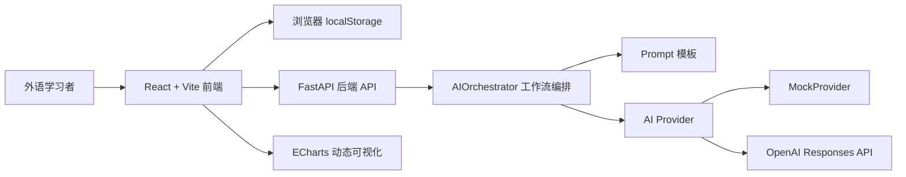
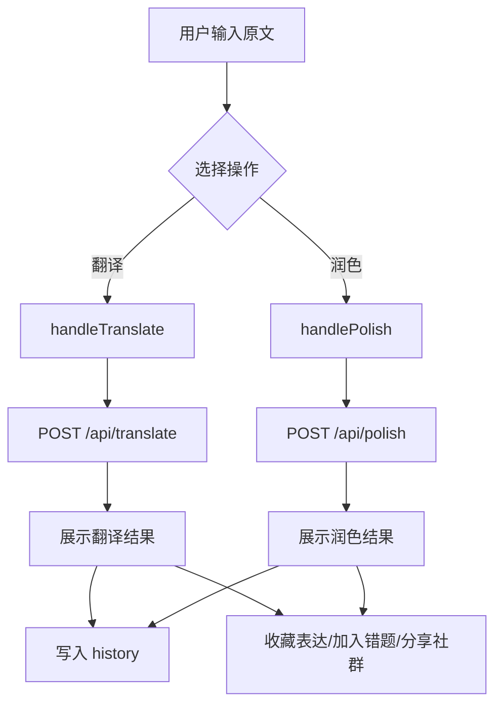
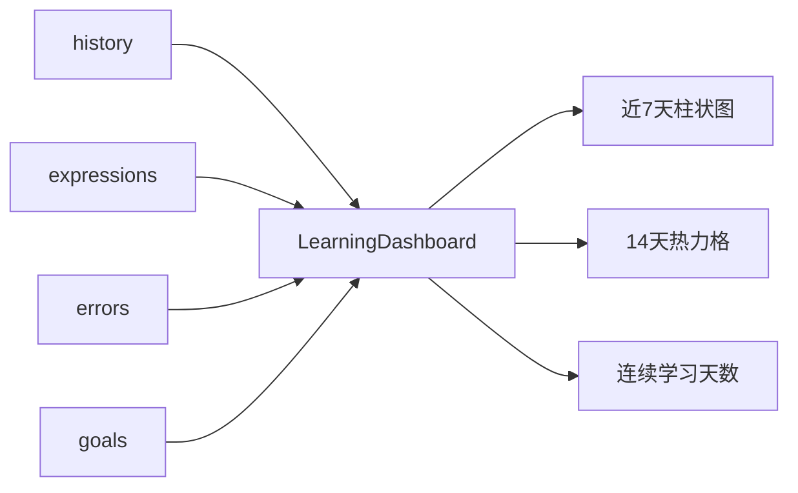
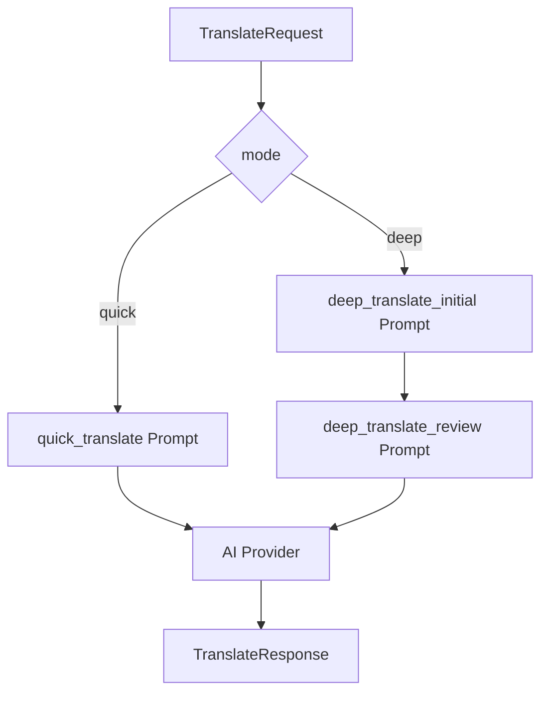
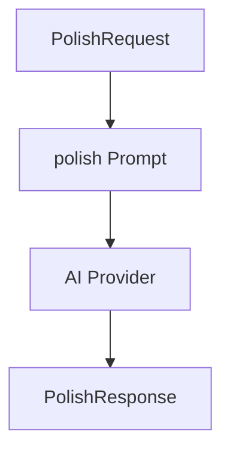

# 技术文档：面向外语学习者的“随写随翻”AI工具

版本：MVP 初版  
最后更新：2026-04-29  
仓库：`Han-Xinlong/ZJSUer_Translation_assistant`

## 1. 文档目的

本文档面向项目开发者、指导教师、答辩评审和后续维护人员，说明“随写随翻”AI工具的技术架构、模块设计、数据流、前端页面细节、后端接口、AI工作流、数据持久化方案和后续演进方向。

当前项目已完成从 0 到 1 的 MVP 初版，核心目标是验证 PPT 中提出的“轻量化 + 可复盘 + 会督促”的 AI 外语学习伙伴是否可落地。

## 2. 总体架构

项目采用“前端轻量、后端服务化、数据本地化”的架构。



### 2.1 架构原则

| 原则 | 当前实现 | 后续方向 |
|---|---|---|
| 前端轻量 | React 单页应用，页面直接进入写作台 | 拆分更多组件，支持路由 |
| 后端服务化 | FastAPI 提供翻译/润色接口 | 增加用户、同步、日志接口 |
| 数据本地化 | localStorage 保存历史、表达、错题、社群、目标 | 升级 IndexedDB |
| AI 可替换 | Provider 抽象支持 mock/openai | 扩展通义、文心等 |
| 过程可复盘 | 历史详情保存初稿、结果、建议 | 增加版本 diff 高亮 |
| 成长可视 | 7天趋势图、14天热力格 | 增加月度报告和导出 |

## 3. 目录结构

```text
ZJSUer_Translation_assistant/
├── backend/
│   ├── app/
│   │   ├── api/routes.py
│   │   ├── core/config.py
│   │   ├── schemas/ai.py
│   │   └── services/
│   │       ├── ai_orchestrator.py
│   │       ├── ai_provider.py
│   │       └── prompt_loader.py
│   ├── .env.example
│   └── requirements.txt
├── frontend/
│   ├── src/
│   │   ├── App.jsx
│   │   ├── api/client.js
│   │   ├── components/
│   │   │   ├── CollectionView.jsx
│   │   │   ├── CommunityView.jsx
│   │   │   ├── CorpusPanel.jsx
│   │   │   ├── HistoryDetail.jsx
│   │   │   ├── InsightPanel.jsx
│   │   │   ├── LearningDashboard.jsx
│   │   │   ├── Sidebar.jsx
│   │   │   └── WorkspaceView.jsx
│   │   ├── data/corpus.js
│   │   ├── data/demoLearning.js
│   │   ├── data/mockHistory.js
│   │   ├── utils/date.js
│   │   ├── utils/report.js
│   │   ├── utils/storage.js
│   │   └── styles.css
│   ├── package.json
│   └── vite.config.js
├── prompts/
│   ├── quick_translate.md
│   ├── deep_translate_initial.md
│   ├── deep_translate_review.md
│   └── polish.md
├── docs/
├── datasets/
└── scripts/
```

## 4. 前端技术实现

### 4.1 技术选型

| 技术 | 用途 | 文件 |
|---|---|---|
| React 18 | 页面状态、组件渲染 | `frontend/src/App.jsx` |
| Vite 4 | 本地开发与构建 | `frontend/vite.config.js` |
| lucide-react | 工具按钮图标 | `frontend/src/components/*` |
| ECharts | 学习趋势图 | `frontend/src/components/LearningDashboard.jsx` |
| localStorage | 本地学习数据持久化 | `frontend/src/utils/storage.js` |
| Web Speech API | 浏览器语音录入 | `frontend/src/App.jsx` 编排，`WorkspaceView` 触发 |

### 4.2 页面布局

当前应用首页即产品工作台，没有营销型落地页。

```text
┌─────────────────────────────────────────────────────────────────────┐
│ Sidebar        │ Main Editor / View                      │ Insight  │
│                │                                         │ Panel    │
│ - 写作台        │ - 写作台 / 表达库 / 错题库 / 历史详情       │          │
│ - 表达库        │ - 学习档案 / 社群互学                      │ 今日复盘  │
│ - 错题库        │                                         │ 最近记录  │
│ - 历史详情      │                                         │ 目标进度  │
│ - 学习档案      │                                         │          │
│ - 社群互学      │                                         │          │
└─────────────────────────────────────────────────────────────────────┘
```

CSS 核心布局：

- `.app-shell`：页面外壳，提供全屏最小高度和整体边距。
- `.workspace`：三栏 CSS Grid，列宽为 `220px minmax(0, 1fr) 280px`。
- `.sidebar`：左侧导航。
- `.editor-panel`：中间主工作区。
- `.insight-panel`：右侧复盘区。
- 小屏下通过 media query 改为单列布局。

### 4.3 前端状态模型

`App.jsx` 是当前前端的状态编排层，负责接口调用、视图选择、学习数据状态和本地持久化。具体页面展示已经拆分到 `frontend/src/components/` 下，避免所有 UI 逻辑堆叠在单一文件中。

组件边界：

| 组件 | 职责 |
|---|---|
| `Sidebar` | 左侧产品品牌和视图导航 |
| `WorkspaceView` | 写作台、工具栏、原文输入、AI 输出、推荐语料 |
| `InsightPanel` | 右侧今日复盘、最近记录、演示工具 |
| `CollectionView` | 表达库与错题库的通用列表 |
| `HistoryDetail` | 单条历史记录复盘、初稿/译文对比、再次收藏 |
| `CommunityView` | 本地社群互学内容展示与移除 |
| `LearningDashboard` | 学习档案、趋势图、热力格和每日目标 |
| `CorpusPanel` | 推荐语料卡片 |

工具层：

| 文件 | 职责 |
|---|---|
| `utils/storage.js` | localStorage 读写、清空项目数据、去重保存 |
| `utils/date.js` | 日期格式化、今日计数、日期 key 生成 |
| `utils/report.js` | Markdown 学习报告生成 |

| 状态 | 类型 | 作用 |
|---|---|---|
| `sourceText` | string | 原文输入 |
| `contextText` | string | 语境说明 |
| `mode` | quick/deep | 翻译模式 |
| `targetLanguage` | string | 目标语言 |
| `translationResult` | object/null | 最近一次翻译结果 |
| `polishResult` | object/null | 最近一次润色结果 |
| `history` | array | 完整历史记录 |
| `expressions` | array | 表达库 |
| `errors` | array | 错题库 |
| `communityPosts` | array | 社群共享内容 |
| `goals` | object | 每日目标 |
| `activeView` | string | 当前中间视图 |
| `selectedHistoryId` | string/null | 当前历史详情 |
| `activeAction` | translate/polish/null | loading 状态 |
| `serviceStatus` | object | AI 服务在线状态、Provider、模型和配置情况 |
| `errorMessage` | string | 错误提示 |
| `isImmersive` | boolean | 沉浸模式 |
| `isListening` | boolean | 语音识别状态 |

### 4.4 视图切换

左侧导航控制 `activeView`：

| 视图 | `activeView` | 说明 |
|---|---|---|
| 写作台 | `workspace` | 文本输入、语境、翻译、润色、语音、沉浸、语料推荐 |
| 表达库 | `expressions` | 已收藏的译文、建议、语料 |
| 错题库 | `errors` | 审校说明、润色修改、历史错误点 |
| 历史详情 | `history` | 初稿与结果对比 |
| 学习档案 | `profile` | 目标、趋势、热力、连续天数 |
| 社群互学 | `community` | 本地共享内容 |

### 4.5 写作台技术细节

写作台由以下区域组成：

1. 顶部模式切换：快速/深度。
2. 工具栏：目标语言、翻译、润色、语音、沉浸。
3. 语境说明输入框。
4. 原文输入区。
5. AI 输出区。
6. 功能卡片。
7. 推荐语料面板。



#### 4.5.1 快速/深度模式

`mode` 取值：

- `quick`：快速翻译。
- `deep`：深度翻译，后端采用初译 + 审校。

对应按钮样式：

- `.mode`
- `.mode.active`

#### 4.5.2 目标语言

当前支持：

- English
- Japanese
- Korean
- Chinese

前端以 `target_language` 字段传给后端。

#### 4.5.3 语境说明

`contextText` 会随请求传入后端：

```js
{
  text: trimmedText,
  context: contextText.trim() || null,
  target_language: targetLanguage,
  mode
}
```

意义：

- 帮助 AI 区分课程作业、正式邮件、校园生活分享等场景。
- 解决普通翻译工具缺少上下文的问题。

#### 4.5.4 语音录入

语音录入使用浏览器 Web Speech API：

```js
const SpeechRecognition = window.SpeechRecognition || window.webkitSpeechRecognition;
```

行为：

- 浏览器支持时启动识别。
- 识别结果追加到 `sourceText`。
- 浏览器不支持时提示用户继续使用文本输入。

限制：

- 不同浏览器支持程度不同。
- 通常需要 HTTPS 或本地开发环境。
- 识别语言当前根据目标语言粗略判断。

#### 4.5.5 沉浸模式

`isImmersive` 控制写作区样式：

- 普通模式：左右双栏，输入与输出并排。
- 沉浸模式：写作区单列、大高度、大字号。

CSS：

- `.writing-grid.immersive`
- `.writing-grid.immersive .writing-box`
- `.writing-grid.immersive textarea`

#### 4.5.6 AI 输出区

翻译结果包含：

- 模式标题：快速翻译/深度翻译。
- Provider 信息：mock/openai。
- Model 信息。
- 译文。
- 审校说明。
- 建议列表。
- 收藏表达按钮。
- 加入错题按钮。
- 分享社群按钮。

润色结果包含：

- 润色版本。
- 修改说明。
- 收藏表达。
- 加入错题。
- 分享社群。

### 4.6 表达库

表达库由 `expressions` 状态驱动，存储在 `EXPRESSIONS_KEY`。

数据结构：

```json
{
  "id": "uuid",
  "text": "表达内容",
  "source": "译文/翻译建议/推荐语料/历史译文",
  "createdAt": "ISO 时间"
}
```

去重逻辑：

- `text + source` 相同则不重复保存。
- 实现在 `saveUniqueItem`。

### 4.7 错题库

错题库由 `errors` 状态驱动，存储在 `ERRORS_KEY`。

典型来源：

- 审校说明。
- 润色修改。
- 历史审校。
- 历史修改。

目的：

- 把 AI 的修改理由变成可复习材料。
- 对抗“AI 改完就忘”的问题。

### 4.8 历史详情

历史记录不再只保存最近 6 条，而是完整保存。右侧最近记录仅展示 `history.slice(0, 6)`。

历史数据结构：

```json
{
  "id": "uuid",
  "type": "快速翻译/深度翻译/润色",
  "text": "结果摘要",
  "sourceText": "原文",
  "targetLanguage": "English",
  "mode": "quick/deep",
  "result": {},
  "createdAt": "ISO 时间"
}
```

历史详情展示：

- 初稿。
- 译文或终稿。
- 审校说明。
- 学习建议或修改说明。
- 收藏表达。
- 加入错题。

### 4.9 学习档案

学习档案由 `LearningDashboard.jsx` 实现。

功能：

- 历史记录数。
- 表达收藏数。
- 错题沉淀数。
- 每日目标配置。
- 今日完成进度。
- 连续学习天数。
- 近 7 天练习趋势。
- 14 天热力格。



#### 4.9.1 ECharts 动态加载

为降低首屏主包体积，ECharts 使用动态 import：

```js
Promise.all([
  import("echarts/core"),
  import("echarts/components"),
  import("echarts/charts"),
  import("echarts/renderers")
])
```

优点：

- 只有打开学习档案时才加载图表库。
- 避免主包超过 Vite 默认警告阈值。

#### 4.9.2 连续学习天数

算法：

1. 将历史、表达、错题合并。
2. 按日期聚合 count。
3. 从今天开始向前扫描，直到某天 count 为 0。

### 4.10 推荐语料

语料文件：

- `frontend/src/data/corpus.js`

匹配逻辑：

- 将 `sourceText`、最近翻译、最近润色结果合并。
- 转小写。
- 与每条语料的 keywords 匹配。
- 展示最多 3 条。
- 无匹配时展示默认前三条。

语料结构：

```json
{
  "id": "campus-life",
  "keywords": ["校园", "学习", "生活", "campus", "study"],
  "title": "Campus Life",
  "expression": "campus learning and daily life",
  "note": "适合描述校园学习、课程和日常活动。"
}
```

### 4.11 社群互学

当前为本地社群初版，不涉及后端账号系统。

数据源：

- `communityPosts`
- `COMMUNITY_KEY`

可分享内容：

- 译文。
- 润色版本。

社群条目：

```json
{
  "id": "uuid",
  "text": "共享内容",
  "source": "译文分享/润色分享",
  "createdAt": "ISO 时间"
}
```

### 4.12 右侧今日复盘

右侧 `insight-panel` 包含：

- 累计表达。
- 待复习错误。
- 今日目标进度。
- 最近 6 条记录。

统计口径：

- 累计表达 = 完整历史记录数 + 表达库数量。
- 今日目标 = 今日历史记录 + 今日表达 + 今日错题。
- 待复习错误 = 错题库数量 + 当前润色修改数量 + 当前审校说明。

## 5. 前端本地存储

文件：`frontend/src/utils/storage.js`

| Key | 内容 |
|---|---|
| `zjsuer.translation.history` | 完整历史记录 |
| `zjsuer.translation.expressions` | 表达库 |
| `zjsuer.translation.errors` | 错题库 |
| `zjsuer.translation.goals` | 每日目标 |
| `zjsuer.translation.community` | 社群共享 |

工具函数：

- `loadCollection`
- `saveCollection`
- `loadObject`
- `saveObject`
- `saveUniqueItem`

## 6. 后端技术实现

### 6.1 FastAPI 应用入口

文件：

- `backend/app/main.py`

职责：

- 创建 FastAPI App。
- 配置 CORS。
- 注册 `/api` 路由。

### 6.2 API 路由

文件：

- `backend/app/api/routes.py`

接口：

| 方法 | 路径 | 功能 |
|---|---|---|
| GET | `/api/health` | 健康检查 |
| GET | `/api/status` | AI 服务状态、Provider、模型和配置完整性 |
| POST | `/api/translate` | 翻译 |
| POST | `/api/polish` | 润色 |

`/api/status` 响应示例：

```json
{
  "status": "ok",
  "provider": "mock",
  "model": "mock",
  "configured": true,
  "message": "Mock provider is active. No API key is required."
}
```

前端启动后会调用该接口，并在右侧“今日复盘”上方展示 AI 服务状态：

- `演示模式`：当前使用 mock provider，不需要 API Key。
- `真实模型`：当前使用真实模型 provider。
- `配置待完善`：例如选择了 OpenAI 但缺少 `OPENAI_API_KEY`。
- `后端离线`：前端无法连接后端。

错误处理：

- Provider 配置错误：503。
- AI 调用错误：502。

### 6.3 Schema 设计

文件：

- `backend/app/schemas/ai.py`

主要模型：

- `TranslationMode`
- `TranslateRequest`
- `TranslateResponse`
- `PolishRequest`
- `PolishResponse`

请求结构：

```json
{
  "text": "待处理文本",
  "source_language": "auto",
  "target_language": "English",
  "mode": "quick",
  "context": "课程作业"
}
```

响应结构：

```json
{
  "mode": "quick",
  "translation": "译文",
  "review": null,
  "suggestions": ["建议"],
  "prompt_keys": ["quick_translate"],
  "provider": "mock",
  "model": null
}
```

### 6.4 AI 编排层

文件：

- `backend/app/services/ai_orchestrator.py`

工作流：



润色流程：



### 6.5 Provider 层

文件：

- `backend/app/services/ai_provider.py`

Provider：

- `MockProvider`
- `OpenAIProvider`

OpenAI 调用：

- 使用 Responses API。
- 请求路径：`/responses`。
- 默认模型：`gpt-5-mini`。
- 要求模型返回 JSON。

环境变量：

```env
AI_PROVIDER=mock
OPENAI_API_KEY=
OPENAI_MODEL=gpt-5-mini
OPENAI_BASE_URL=https://api.openai.com/v1
OPENAI_TIMEOUT_SECONDS=60
OPENAI_MAX_OUTPUT_TOKENS=1200
```

## 7. Prompt 设计

Prompt 文件均放在 `prompts/`。

| Prompt | 用途 | 期望输出 |
|---|---|---|
| `quick_translate.md` | 快速翻译 | `translation`, `suggestions` |
| `deep_translate_initial.md` | 深度初译 | `translation`, `key_choices`, `ambiguities` |
| `deep_translate_review.md` | 深度审校 | `final_translation`, `review`, `suggestions` |
| `polish.md` | 润色 | `polished_text`, `changes` |

关键原则：

- 返回严格 JSON。
- 解释要服务学习内化。
- 避免把学习者文本过度改写到失去个人表达。

## 8. 开发与运行

### 8.1 安装依赖

前端：

```bash
cd frontend
npm install
```

后端：

```bash
cd backend
python3 -m venv .venv
source .venv/bin/activate
pip install -r requirements.txt
```

### 8.2 启动

后端：

```bash
bash scripts/dev_backend.sh
```

前端：

```bash
bash scripts/dev_frontend.sh
```

访问：

```text
http://127.0.0.1:5173/
```

### 8.3 验证

```bash
npm --prefix frontend test
npm --prefix frontend run build
cd backend && .venv/bin/python -m pytest
python3 -m compileall backend/app
```

仓库已配置 GitHub Actions：

- 工作流文件：`.github/workflows/ci.yml`
- 触发时机：push 到 `main`、Pull Request。
- 前端 Job：Node 18、`npm ci`、`npm test`、`npm run build`。
- 后端 Job：Python 3.10、安装 `backend/requirements-dev.txt`、`pytest`、`python -m compileall app`。

### 8.4 托管平台部署

当前推荐的小范围内部测试部署方案：

| 层 | 平台 | 配置文件 | 说明 |
|---|---|---|---|
| 前端 | Vercel | `frontend/vercel.json` | Vite 静态站点 |
| 后端 | Render | `render.yaml` | FastAPI Web Service |

部署说明见：

- `docs/deployment.md`

核心环境变量：

| 环境变量 | 位置 | 说明 |
|---|---|---|
| `VITE_API_BASE_URL` | Vercel 前端 | Render 后端地址，不带 `/api` |
| `ALLOWED_ORIGINS` | Render 后端 | Vercel 前端地址，JSON 数组字符串 |
| `AI_PROVIDER` | Render 后端 | 初期为 `mock`，真实模型为 `openai` |
| `OPENAI_API_KEY` | Render 后端 | 仅真实模型模式需要 |

当前前端单元测试使用 Vitest，已覆盖：

- `frontend/src/utils/date.js`：日期 key、缺省日期展示、今日条目统计。
- `frontend/src/utils/report.js`：Markdown 学习报告的统计字段、最近记录和空状态。
- `frontend/src/utils/storage.js`：localStorage 读写、异常 fallback、项目数据清空、表达去重。

当前后端单元测试使用 pytest，已覆盖：

- `GET /api/health`：基础健康检查。
- `GET /api/status`：mock provider 状态。
- `POST /api/translate`：mock 快速翻译。
- `POST /api/translate`：mock 深度翻译与 prompt 链。
- `POST /api/polish`：mock 润色。
- 请求校验：空文本返回 422。

## 9. 当前限制

| 限制 | 说明 | 后续方案 |
|---|---|---|
| 数据仅本地保存 | localStorage 容量和结构能力有限 | 升级 IndexedDB |
| 社群互学为本地版 | 暂无账号和多人同步 | 增加后端用户与同步 |
| 语音识别依赖浏览器 | Safari/Chrome 支持差异明显 | 增加兼容提示和手动 fallback |
| AI 真实效果未充分评测 | 当前默认 mock | 配置真实 Key 后做样例评估 |
| 组件仍可继续细分 | `WorkspaceView` 和 `LearningDashboard` 后续可能继续增长 | 按结果区、图表区、演示工具继续拆分 |
| 浏览器交互测试不足 | 已有工具函数单测，尚缺端到端交互覆盖 | 增加 Playwright |

## 10. 后续技术演进建议

1. **组件继续细分**
   当前已完成第一轮组件化，后续可继续拆分 `WorkspaceView` 的 AI 结果区和 `LearningDashboard` 的图表区。

2. **数据层升级**
   用 IndexedDB 替代 localStorage，支持更完整的历史、版本和检索。

3. **AI 评估集**
   建立 `datasets/evaluation_samples.json`，对快速/深度/润色输出进行人工评分。

4. **报告能力增强**
   当前已支持 Markdown 学习报告导出，后续可增加 Word/PDF 导出和教师端汇总。

5. **后端同步**
   增加用户系统、云端备份、社群共享 API。

6. **自动化测试**
   当前已增加前端工具函数单元测试，后续继续补 API 测试和浏览器端交互测试。
